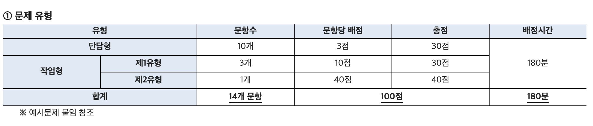
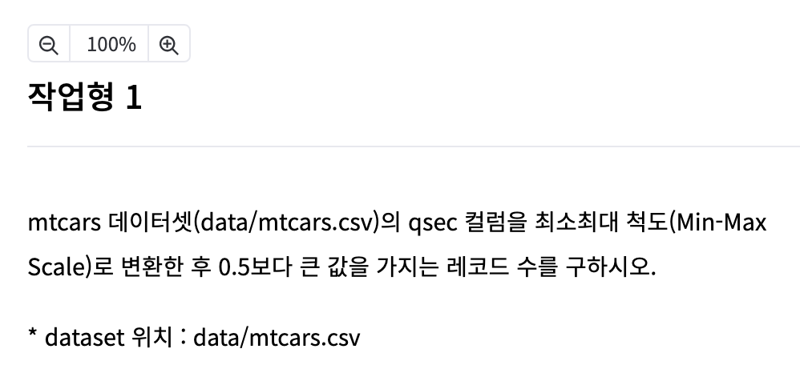
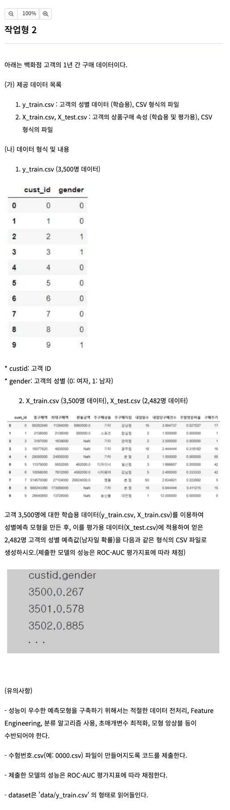

[toc]

빅데이터분석기사 실기준비자료 - 2021.05


# 실기 문제 유형


**문제유형**




**단답형**


**작업형 1**




**작업형 2**




## 파이썬 패키지 

파이썬 주요패키지 목록

beautifulsoup4

selenium

requests

matplotlib

numpy

pandas

scikit-learn

scipy

xgboost


## 전처리

인코딩 

scaler 

결측값 

이상값 

중복값


# 공부법

- 단답형 : 필기 정리해놓은것 보기
- 작업형1 : 공룡책 여러 기법들 숙지
- 작업형2 : 앙상블 등 머신러닝 전체 (데이터 전처리, 피처엔지니어링, 분류, 하이퍼파라미터 최적화, 모형 앙상블 등)


# 정리

## numpy

```python
import numpy as np

# np.array() : list -> ndarray
array1 = np.array(list1)

# reshape() : ndarray 차원 크기 변경 
array2 = array1.reshape(2, 5)
array2 = array1.reshape(-1, 5) # 5열에 맞는 행을 알아서 적용 
array2 = array1.reshape(5, -1) # 5행에 맞는 열을 알아서 적용 

# tolist() : ndarray -> list
print(array3.tolist())

# 인덱싱 
print(array1[-1]) 					# 뒤에서부터 첫번째값
array3 = array1[0:3] 				# 0 ~ 2 인덱스까지의 값 
array3 = array1[3:] 				# 3부터 끝까지 
array3 = array1[:] 					# 처음부터 끝까지
array3 = array2d[[0,1], 2]  # 인덱스에 해당하는 값을 반환 
array3 = array1[array1 > 5] # 5보다 큰 값만 출력

# 정렬
sort_array1 = np.sort(org_array)					# 원행렬 유지, 정렬된 행렬 반환 
sort_array2 = org_array.sort() 						# 반환값 None, 원행렬 변환
sort_array1 = np.sort(org_array, axis=0)	# 2차원 이상일경우 열마다 정렬 (디폴트가 axis=0)
sort_array1 = np.sort(org_array, axis=1)	# 2차원 이상일경우 행마다 정렬 
sort_indices = np.argsort(org_array)			# 정렬된 행렬의 인덱스 반환

# 선형대수 연산
dot_product = np.dot(array1, array2)			# 두 행렬의 내적곱 반환
transpose_mat = np.transpose(array1)			# 행렬의 전치행렬 반환 
```


## 각종 문법

**GridSearchCV**

```python
from sklearn.model_selection import GridSearchCV

grid_dtree = GridSearchCV(dt_clf, param_grid=parameters, cv=3, refit=True)
```


**cross_val_score**

```python
from sklearn.model_selection import cross_val_score, cross_validate

scores = cross_val_score(dt_clf, data, label, scoring='accuracy', cv=3)
```


**LabelEncoder**

```python
from sklearn.preprocessing import LabelEncoder

encoder = LabelEncoder()
encoder.fit(items)
labels = encoder.transform(items)
```


**OneHotEncoder**

```python
from sklearn.preprocessing import OneHotEncoder
df2 = pd.get_dummies(df)
# 알아서 카테고리 변수만 인코딩하여 반환
```


**StandardScaler**

```python
from sklearn.preprocessing import StandardScaler

scaler = StandardScaler()
scaler.fit(iris_df)
iris_scaled = scaler.transform(iris_df)
# 원핫인코딩 후 해아함. 안그러면 카테고리변수는 스케일링 못함. 
iris_df_scaled = pd.DataFrame(data=iris_scaled, columns=iris.feature_names)
```


**MinMaxScaler**

```python
from sklearn.preprocessing import MinMaxScaler

scaler = MinMaxScaler()
scaler.fit(iris_df)
iris_scaled = scaler.transform(iris_df) # ndarray로 반환

iris_df_scaled = pd.DataFrame(data=iris_scaled, columns=iris.feature_names)
```


**VotingClassifier**

```python
vo_clf = VotingClassifier(estimators=[('LR', lr_clf), ('KNN', knn_clf)], voting='soft')
vo_clf.fit(X_train, y_train)
pred = vo_clf.predict(X_test)
```


**RandomForestClassifier**

```python
from sklearn.ensemble import RandomForestClassifier
rl_clf = RandomForestClassifier(random_state=0)
rl_clf.fit(X_train, y_train)
pred = rl_clf.predict(X_test)
```


**XGBoost**

```python
from xgboost import XGBClassifier
# 매개변수 : n_estimators, learning_rate, max_depth
xgb_wrapper = XGBClassifier(n_estimators=400, learning_rate=0.1, max_depth=3)
xgb_wrapper.fit(X_train, y_train)
w_preds = xgb_wrapper.predict(X_test)
```


**LinearRegression**

```python
from sklearn.linear_model import LinearRegression
lr = LinearRegression()
lr.fit(X_train, y_train)
y_preds = lr.predict(X_test)
# LogisticRegression, RandomForestRegressor도 동일
```


**datetime**

```python
bike_df['datetime'] = bike_df.datetime.apply(pd.to_datetime)

bike_df['year'] = bike_df.datetime.apply(lambda x : x.year)
bike_df['month'] = bike_df.datetime.apply(lambda x : x.month)
bike_df['day'] = bike_df.datetime.apply(lambda x : x.day)
bike_df['hour'] = bike_df.datetime.apply(lambda x : x.hour)
```


**np.log1p**

```python
y_target_log = np.log1p(y_target)
```


**pd.concat**

```python
# 실제 예제는 y_test가 없고 예측값을 csv로 저장하게 되있음 
# concat을 하려면 input들이 모두 Series or DF여야함 
test_gender = pd.Series(y_pred[:, 1])
results = pd.concat([test.cust_id, test_gender], axis=1)
results.to_csv("practice_no2.csv", index=False)
```


# 유의점

- Scaler의 fit_transform() 메소드에는 넘파이 2차원 배열이 들어와야함. 

  ```python
  # to_numpy()로 배열화한 후 reshape()로 2차원배열로 만듦 
  X = df['qsec'].to_numpy().reshape(-1, 1)
  df['qsec'] = scaler.fit_transform(X)
  ```

- 원핫인코딩은 데이터프레임의 categorical 변수만 뽑아서 변환시켜주므로, 따로 빼서 처리할 필요 없음 

  ```python
  x_dum = pd.get_dummies(x)
  ```

- 작업형 2유형 진행방식
  1. 데이터프레임의 칼럼을 drop하여 X와  y로 나누기 
  2. 원핫인코딩 (X_train, X_test)
  3. Standard Scaler/ MinMaxScaler : Train으로 학습 후(fit) X_train, X_test로 transform 하기 
  4. 랜덤포레스트로 학습 
  5. kfold로 여러 분류기로 학습 
  6. 상위성능 2개 모델의 하이퍼파라미터 튜닝 후 vote 앙상블 
  7. pd.concat 으로 식별자와 예측한 타겟값 합침
